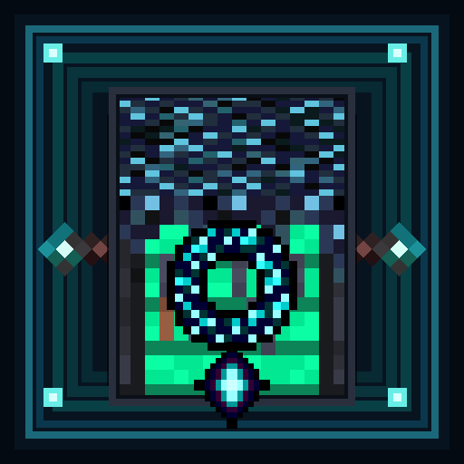

  

# Sculk-Infused Netherite

Expand your progression into the Deep Dark with Sculk-Infused Netherite equipment, custom enchantments, powerful Warden-themed utilities, and the Sculk Workbench.

## Official Downloads

- [GitHub Releases](https://github.com/JustCax/Sculk-Infused-Netherite/releases)
- [CurseForge](https://www.curseforge.com/minecraft/mc-mods/sculk-infused-netherite)
- Modrinth — under review

> **Unofficial addon project.**  
> Sculk-Infused Netherite is not affiliated with or endorsed by Mojang Studios, Microsoft, or the creators of the mods it integrates with.

## About

Sculk-Infused Netherite is a late-game progression addon for Minecraft 1.21.1 on NeoForge.

Upgrade Advanced Netherite Diamond equipment using Deep Dark resources in the custom **Sculk Workbench**, unlock Warden-themed utility items, use custom enchantments, and progress through a dedicated advancement tree.

## Features

- Sculk-Infused Netherite armor set
- Sculk-Infused Netherite tools and weapons
- Custom **Sculk Workbench**
- Custom Deep Dark-themed enchantments
- **Warden Ring** accessory
- **Sculk-Infused Golden Apple**
- **Sonic Aegis** and **Cracked Sonic Aegis**
- **Quieting Sigil**
- **Vibration Decoy**
- Custom advancement progression
- JEI integration for Sculk Workbench recipes
- Enchanting Infuser compatibility
- Ancient City loot integration
- Deeper and Darker Ancient Temple loot integration
- Custom tooltips, particles and sound effects

## Requirements

### Required

- Minecraft 1.21.1
- NeoForge
- Advanced Netherite
- Deeper and Darker
- Accessories

### Optional integrations

- Just Enough Items (JEI)
- Enchanting Infuser

## Tested environment

The 1.0.1 release candidate was tested with:

- Minecraft 1.21.1
- NeoForge 21.1.232
- Advanced Netherite 2.3.1
- Deeper and Darker 1.4.1
- Accessories 1.1.0-beta.53+1.21.1
- JEI 19.21.0.247
- Enchanting Infuser 21.1.4

These are the versions used for the final 1.0.0 regression test and the 1.0.1 verification test. Version 1.0.1 contains metadata and localization fixes only; its gameplay code is unchanged from 1.0.0.

Later dependency versions may also work.

## Sculk Workbench

The Sculk Workbench is the core crafting station of the mod.

It is used to upgrade Advanced Netherite Diamond equipment into Sculk-Infused Netherite gear and to craft several Warden-themed utility items.

## Credits

Created by **JustCax** and **BlackCatGirl_08**.

**Texture Artist:** BlackCatGirl_08

All textures are original assets created specifically for this project.

Made with MCreator.

See [CREDITS.md](CREDITS.md) for additional project and dependency credits.

## Contact

For questions or other inquiries:

- **JustCax** — Discord: `caxtmt`
- **BlackCatGirl_08** — Discord: `blackcatgirl_08`

For bug reports, please prefer the [GitHub Issue Tracker](https://github.com/JustCax/Sculk-Infused-Netherite/issues).

## Modpack Policy

Unmodified official releases of Sculk-Infused Netherite may be included in modpacks, provided that the mod is obtained from an official distribution source.

Reuploads, modified distributions, derivative releases, and reuse of project assets require explicit permission.

## License

**All Rights Reserved.**

See [LICENSE](LICENSE) for the project terms.

Third-party projects and dependencies remain governed by their own licenses.
